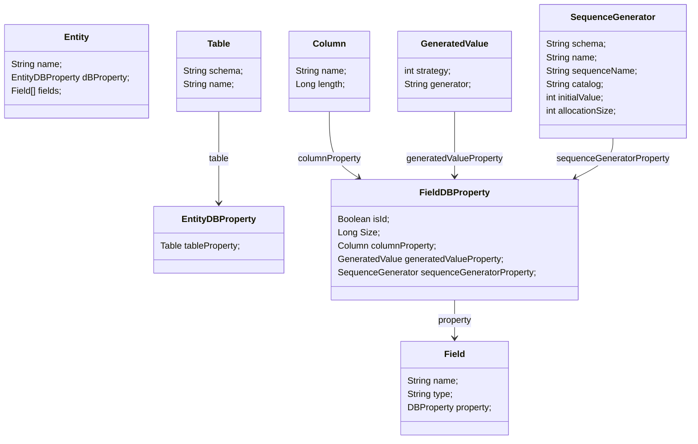

# Spring API Generator

* Define entityes
* Define services
* Define managers
* Define endpoints
* 

## Entity define

```json
{
  "entity":
          [
            {
              "name": "User",
              "DBProperty":
              {
                "Table":
                {
                  "schema": "entityGenerationTest",
                  "name": "user"
                }
              },
              "fields":
                      [
                        {
                          "name": "id",
                          "type": "Long",
                          "DBProperty":
                          {
                            "isId": true,
                            "Size": 50,
                            "Column":
                            {
                              "length": 50,
                              "name": "id"
                            },
                            "GeneratedValue":
                            {
                              "strategy": "GenerationType.SEQUENCE",
                              "generator": "USER_SEQ"
                            },
                            "SequenceGenerator":
                            {
                              "schema": "entityGenerationTest",
                              "name" : "USER_SEQ",
                              "sequenceName": "",
                              "catalog": "",
                              "initialValue": 0,
                              "allocationSize": 1
                            }
                          }
                        }
                      ]
            }
          ]
}
```



